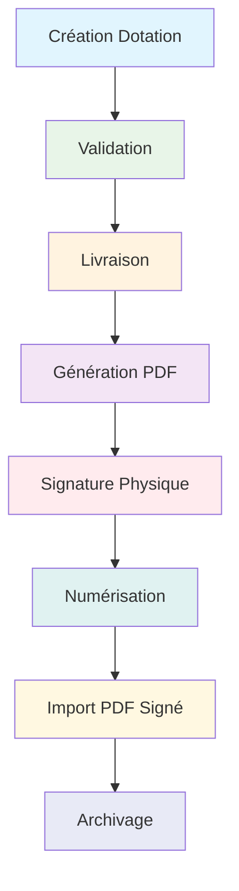

# 📋 Système d'Import de Décharges Signées

## 🎯 Objectif

Permettre l'import des fichiers PDF de décharges signées par les responsables hiérarchiques pour les dotations livrées, afin de finaliser officiellement le processus de dotation.

---

## 📋 Fonctionnalités

### ✅ Import de PDF Signé
- **Disponible pour**: Dotations avec statut "Livrée"
- **Format**: PDF uniquement
- **Taille maximale**: 10MB
- **Stockage**: Répertoire `uploads/decharges_signees/`

### ✅ Téléchargement du PDF Signé
- **Disponible pour**: Dotations avec PDF signé importé
- **Nom du fichier**: `decharge_signee_{numero_dotation}_{nom_original}`
- **Accès**: Bouton vert "SIGNÉE" dans l'interface

### ✅ Interface Intuitive
- **Modal d'import**: Design moderne avec validation
- **Notifications**: Messages de succès/erreur
- **Mise à jour automatique**: Rechargement de la page après import

---

## 🚀 Installation et Configuration

### 1. Migration de la Base de Données

```bash
# Exécuter le script de migration
python add_decharge_signee_fields.py
```

**Ce script ajoute:**
- `decharge_signee_path` (VARCHAR 500) - Chemin du fichier
- `decharge_signee_filename` (VARCHAR 200) - Nom original
- `decharge_signee_date` (DATETIME) - Date d'import

### 2. Création des Répertoires

Le script crée automatiquement:
```
uploads/
└── decharges_signees/
    └── (fichiers PDF importés)
```

### 3. Redémarrage de l'Application

```bash
# Arrêter l'application (Ctrl+C)
# Redémarrer
python app.py
```

---

## 📖 Guide d'Utilisation

### Étape 1: Générer la Décharge Initiale

1. **Créer une dotation** → Statut "En cours"
2. **Valider la dotation** → Statut "Validée"  
3. **Marquer comme livrée** → Statut "Livrée"
4. **Générer le PDF** → Bouton bleu "LIVRÉE"

### Étape 2: Signer le PDF

1. **Imprimer** le PDF généré
2. **Faire signer** par les responsables hiérarchiques
3. **Scanner** le document signé
4. **Sauvegarder** en format PDF

### Étape 3: Importer le PDF Signé

1. **Aller** dans la liste des dotations
2. **Repérer** la dotation livrée (statut "Livrée")
3. **Cliquer** sur le bouton orange "IMPORTER"
4. **Sélectionner** le fichier PDF signé
5. **Valider** l'import

### Étape 4: Télécharger le PDF Signé

Une fois importé:
- **Bouton vert "SIGNÉE"** apparaît
- **Cliquez** pour télécharger le PDF signé
- **Nom du fichier**: `decharge_signee_DOT-2025-001_20251123_143022_decharge_signee.pdf`

---

## 🎨 Interface Utilisateur

### Boutons dans la Colonne STATUT

| Statut | Boutons Disponibles | Description |
|--------|-------------------|-------------|
| **En cours** | 🟡 **EN COURS** | Passe au statut "Validée" |
| **Validée** | 🟢 **VALIDÉE** | Passe au statut "Livrée" |
| **Livrée** | 🟠 **IMPORTER** ou 🟢 **SIGNÉE** | Importer ou télécharger le PDF signé |
| **Livrée** | 🔵 **LIVRÉE** | Générer le PDF initial |

### Modal d'Import

```
┌─────────────────────────────────────────┐
│ 📝 Importer la Décharge Signée      [×] │ ← En-tête orange
├─────────────────────────────────────────┤
│ ℹ️ Dotation N°: DOT-2025-001            │ ← Info alerte
│    Veuillez sélectionner le fichier... │
├─────────────────────────────────────────┤
│ 📄 Fichier PDF Signé *                  │ ← Zone de sélection
│    [Choisir un fichier]                │
│    Seuls les PDF sont acceptés...       │
├─────────────────────────────────────────┤
│           [Annuler]  [Importer]        │ ← Boutons
└─────────────────────────────────────────┘
```

---

## 🔧 Architecture Technique

### Modèle de Données

```python
class Dotation(db.Model):
    # ... champs existants ...
    
    # NOUVEAUX: Champ pour le fichier PDF de décharge signée
    decharge_signee_path = db.Column(db.String(500), nullable=True)
    decharge_signee_filename = db.Column(db.String(200), nullable=True)
    decharge_signee_date = db.Column(db.DateTime, nullable=True)
```

### Routes API

| Route | Méthode | Description |
|-------|---------|-------------|
| `/dotations/<id>/import-decharge` | POST | Importer le PDF signé |
| `/dotations/<id>/telecharger-decharge` | GET | Télécharger le PDF signé |

### Validation

- ✅ **Statut**: Doit être "livree"
- ✅ **Format**: PDF uniquement
- ✅ **Taille**: Max 10MB
- ✅ **Sécurité**: Nom de fichier sécurisé
- ✅ **Stockage**: Répertoire dédié

---

## 📁 Gestion des Fichiers

### Structure de Stockage

```
uploads/decharges_signees/
├── decharge_DOT-2025-001_20251123_143022_decharge_signee.pdf
├── decharge_DOT-2025-002_20251123_144515_scan_decharge.pdf
└── decharge_DOT-2025-003_20251123_150210_decharge_finale.pdf
```

### Nomenclature des Fichiers

```
decharge_{numero_dotation}_{timestamp}_{nom_original}
```

**Exemple:**
- `decharge_DOT-2025-001_20251123_143022_decharge_signee.pdf`
- `numero_dotation`: DOT-2025-001
- `timestamp`: 20251123_143022 (23/11/2025 14:30:22)
- `nom_original`: decharge_signee.pdf

---

## 🔍 Journal d'Audit

### Actions Enregistrées

Chaque import est enregistré dans le log d'audit:

```json
{
    "action": "update",
    "entity_type": "dotation",
    "entity_id": 123,
    "entity_name": "DOT-2025-001",
    "description": "PDF signé importé | Fichier: decharge_signee.pdf",
    "user_id": 1,
    "user_name": "Admin",
    "created_at": "2025-11-23T14:30:22.123456"
}
```

---

## ⚠️ Messages d'Erreur

| Erreur | Cause | Solution |
|--------|-------|----------|
| "Le PDF signé ne peut être importé que pour les dotations livrées" | Statut ≠ "livree" | Marquer la dotation comme livrée d'abord |
| "Aucun fichier n'a été sélectionné" | Fichier vide | Sélectionner un fichier PDF |
| "Le fichier doit être au format PDF" | Mauvais format | Choisir un fichier .pdf |
| "Erreur lors de l'import" | Problème serveur | Vérifier les logs et réessayer |
| "Aucun PDF signé n'est disponible" | Fichier manquant | Importer un PDF signé d'abord |

---

## 🛠️ Maintenance

### Nettoyage des Fichiers

Les fichiers PDF signés sont conservés indéfiniment. Pour nettoyer:

```python
# Script de nettoyage (optionnel)
import os
import datetime

def cleanup_old_decharges(days=365):
    """Supprime les PDF signés de plus de X jours"""
    upload_dir = 'uploads/decharges_signees'
    cutoff_date = datetime.datetime.now() - datetime.timedelta(days=days)
    
    for filename in os.listdir(upload_dir):
        filepath = os.path.join(upload_dir, filename)
        file_date = datetime.datetime.fromtimestamp(os.path.getctime(filepath))
        
        if file_date < cutoff_date:
            os.remove(filepath)
            print(f"Supprimé: {filename}")
```

### Sauvegarde

Inclure le répertoire `uploads/decharges_signees/` dans les sauvegardes régulières.

---

## 📊 Statistiques et Rapports

### Requêtes SQL Utiles

```sql
-- Nombre de décharges signées par mois
SELECT 
    strftime('%Y-%m', decharge_signee_date) as mois,
    COUNT(*) as nb_decharges
FROM dotations 
WHERE decharge_signee_path IS NOT NULL
GROUP BY mois
ORDER BY mois DESC;

-- Taux de signature (décharges signées / livraisons totales)
SELECT 
    COUNT(*) as total_livrees,
    SUM(CASE WHEN decharge_signee_path IS NOT NULL THEN 1 ELSE 0 END) as signees,
    ROUND(
        100.0 * SUM(CASE WHEN decharge_signee_path IS NOT NULL THEN 1 ELSE 0 END) / 
        COUNT(*), 2
    ) as taux_signature
FROM dotations 
WHERE statut = 'livree';
```

---

## 🔄 Processus Complet



---

## 📞 Support et Dépannage

### Problèmes Courants

1. **Bouton "IMPORTER" invisible**
   - Vérifier que la dotation est bien en statut "Livrée"
   - Vérifier les permissions de l'utilisateur

2. **Import échoue**
   - Vérifier le format du fichier (PDF obligatoire)
   - Vérifier la taille (< 10MB)
   - Vérifier les permissions du répertoire uploads/

3. **Téléchargement impossible**
   - Vérifier que le PDF a bien été importé
   - Vérifier que le fichier existe sur le serveur

### Logs d'Erreurs

Les erreurs sont enregistrées dans:
- **Console Flask**: Messages d'erreur détaillés
- **Log d'audit**: Actions utilisateur
- **Fichiers temporaires**: Uploads échoués

---

## 📈 Évolutions Futures

### Fonctionnalités Prévues

1. **Signature Numérique**: Intégration de certificats numériques
2. **Workflow Multi-niveaux**: Validation par plusieurs responsables
3. **Notification Email**: Alertes automatiques de signature
4. **Visionneuse Intégrée**: Prévisualisation PDF dans l'interface
5. **Export en Masse**: Téléchargement multiple de décharges

### Améliorations Techniques

1. **Stockage Cloud**: AWS S3 / Google Drive
2. **Compression**: Optimisation de la taille des fichiers
3. **Versioning**: Historique des modifications
4. **API REST**: Intégration avec d'autres systèmes

---

## 📝 Résumé

Le système d'import de décharges signées permet de:

✅ **Finaliser** le processus de dotation avec signature officielle  
✅ **Archiver** les documents signés numériquement  
✅ **Traçabilité** complète avec logs d'audit  
✅ **Interface** intuitive et moderne  
✅ **Sécurité** des données avec validation stricte  

**Installation rapide:** `python add_decharge_signee_fields.py`

---

*Document créé le 23/11/2025 - Système de Gestion Stock*
